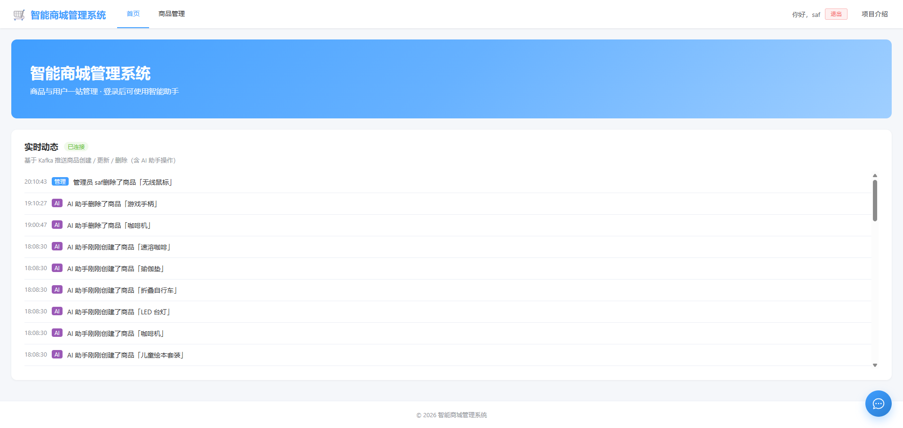
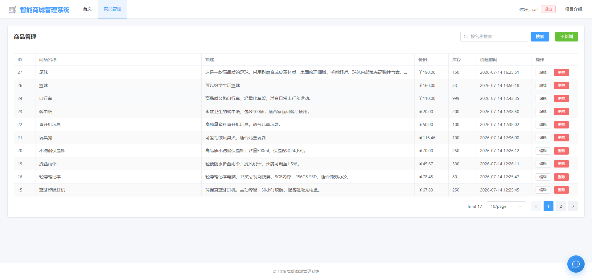
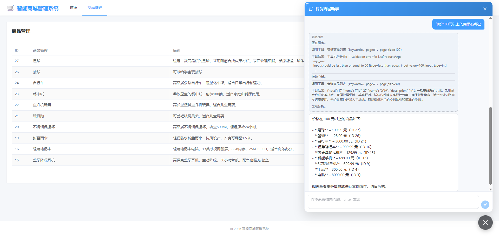
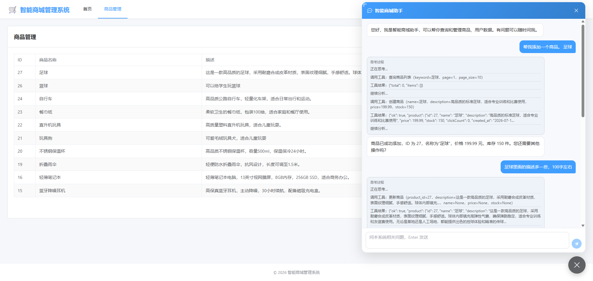
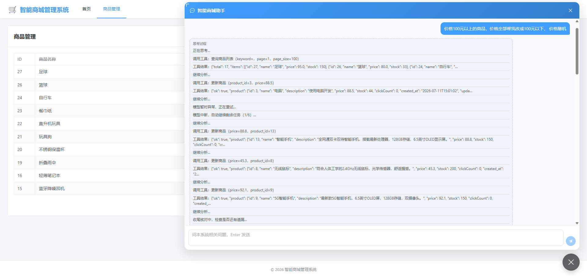
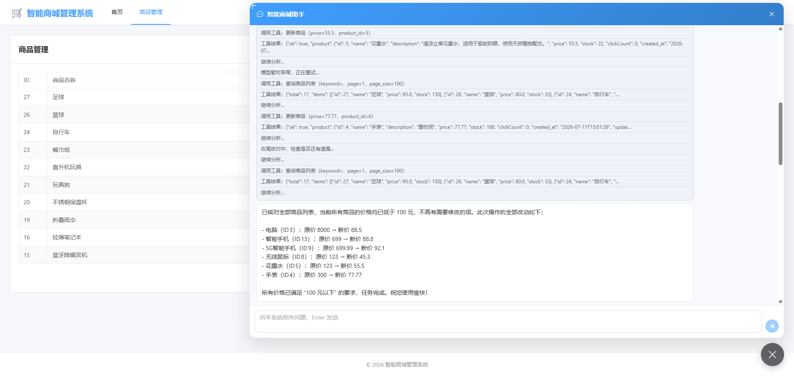

# 智能商城管理系统

全栈项目：**Vue 3 + FastAPI + MySQL + Kafka**，登录后管理商品；集成 **LangChain Tool Calling + SSE** 的 AI 助手（可查询/增删改商品与用户）；首页通过 **Kafka → SSE** 展示商品操作实时动态；配套 **Docker Compose** 与 **GitHub Actions → GHCR → SSH** 自动部署。

不只调用 Chat API，而是把鉴权、工具循环、流式输出、写库后前端刷新、事件总线、容器化发布串成可运行闭环。应用内更完整的讲解见前端路由 **`/about`（项目介绍）**。

## 界面预览

### 首页

系统入口；下方为基于 Kafka 的商品操作实时动态（管理端 / AI 助手）。



### 商品管理

登录后分页 CRUD：搜索、新增、编辑、删除。



## 技术栈

| 层 | 技术 |
| --- | --- |
| 前端 | Vue 3、TypeScript、Vite、Element Plus、Vue Router、Axios |
| 后端 | Python 3.11、FastAPI、SQLAlchemy 2、Pydantic、PyMySQL、aiokafka |
| 鉴权 | JWT（python-jose）+ bcrypt |
| AI | LangChain + ChatOllama（Ollama Cloud）、SSE 流式、StructuredTool |
| 消息 | Apache Kafka（KRaft 单节点）、商品动态落库 + SSE 扇出 |
| 基础设施 | MySQL 8、Nginx、Docker Compose、GitHub Actions、GHCR |

## 功能概览

| 模块 | 说明 |
| --- | --- |
| 首页 | 系统入口；SSE 订阅 `/api/activities/stream` 展示实时动态 |
| 商品管理 | 登录后分页 CRUD；写接口依赖 JWT；写库后发 Kafka 事件 |
| 注册 / 登录 | 密码 bcrypt 入库；JWT 存前端，路由守卫保护管理页 |
| AI 智能助手 | 悬浮聊天；Tool Calling 操作商品/用户；需登录后使用；写库同样发动态 |
| 数据同步 | 助手写库成功后 SSE `done.refresh`，前端按资源名刷新列表 |
| 部署 | 本地 Compose 一键起（含 Kafka）；push `main` 自动构建镜像并部署 |

**设计取舍：** 用户管理无独立后台页，由助手工具完成；当前无 RBAC（登录用户权限相同）。

## AI 助手演示

助手以自然语言操作商品/用户，UI 展示「思考过程」（工具调用、校验失败自纠、模型异常重试），写库成功后前端列表自动刷新，首页动态同步出现。

### 查询与参数自纠

用户问「单价 100 元以上的商品」→ 调用 `查询商品列表`；`page_size` 超限报错后自动缩小参数重试，再汇总回复。



### 创建与更新商品

自然语言新增商品，再按要求扩写描述；助手依次调用查询 / 创建 / 更新工具，管理页同步刷新。



### 批量改价（多轮工具循环）

「把 100 元以上商品改成 100 元以下随机价」→ 多轮 `更新商品`；遇模型中断会自动续跑，并做收尾核对。



完成后给出变更清单与结论：



## 架构

```
浏览器 (Vue SPA)
  ├─ REST  /api/*              → Nginx → FastAPI → MySQL
  ├─ SSE   /api/chat           → FastAPI chat_stream
  │                              → LangChain + Ollama（多轮 Tool Calling）
  │                              → tools（ContextVar 注入 db / 当前用户）
  │                              → 写库成功则 done.refresh 通知前端
  └─ SSE   /api/activities/stream
                                 ← ActivityHub 扇出
                                 ← Kafka Consumer 落库 activities
                                 ← Producer（管理端 / 助手写商品）
```

后端分层：`routers` → `schemas` → `crud` → `models`；`dependencies` 注入会话与用户。助手侧用 `asyncio.to_thread` + 短生命周期 Session，避免阻塞事件循环。商品写操作经 `kafka_bus` 发事件，Consumer 持久化并推给首页 SSE。

## 仓库结构

```
ai-mall-admin/
├── backend/
│   ├── app/
│   │   ├── main.py           # FastAPI 入口、CORS、建表、Kafka 生命周期
│   │   ├── config.py         # 环境变量（含 Ollama / Kafka）
│   │   ├── database.py
│   │   ├── models.py         # users / products / activities
│   │   ├── schemas.py
│   │   ├── crud.py
│   │   ├── security.py       # 密码哈希与 JWT
│   │   ├── dependencies.py
│   │   ├── llm.py            # 工具循环、SSE 事件、登录短路
│   │   ├── kafka_bus.py      # 商品动态 Producer / Consumer
│   │   ├── activity_hub.py   # 内存扇出给 SSE 订阅者
│   │   ├── tools/            # 商品/用户 StructuredTool 包
│   │   └── routers/          # auth、products、chat、activities、health
│   ├── .env.example
│   ├── Dockerfile
│   └── requirements.txt
├── frontend/
│   ├── Dockerfile            # 多阶段：npm build → nginx
│   └── src/
│       ├── views/            # Home、About、Login、Register、ProductsAdmin
│       ├── components/       # AiAssistant
│       ├── composables/      # useAuth、useDataRefresh
│       ├── api.ts            # Axios + SSE chat
│       └── router/
├── docs/screenshots/         # README 界面与 AI 助手截图
├── docker/nginx.conf         # 静态资源 + /api 反代（SSE 关闭缓冲）
├── .github/workflows/ci-cd.yml
├── docker-compose.yml
├── docker-compose.prod.yml
└── .env.example
```

## 本地开发

本地跑后端时需要 **MySQL** 与 **Kafka**（动态功能依赖 Kafka，无本机降级）。可只起基础设施：

```bash
# 在项目根目录：只启动 MySQL + Kafka
docker compose up -d mysql kafka
```

### 1. 后端

先确保 MySQL 中有数据库（Compose 会自动建 `crud_demo`；纯本机 MySQL 则手动创建）：

```sql
CREATE DATABASE crud_demo CHARACTER SET utf8mb4 COLLATE utf8mb4_unicode_ci;
```

```bash
cd backend
python -m venv .venv
# Windows:
.venv\Scripts\activate
# macOS/Linux:
# source .venv/bin/activate

pip install -r requirements.txt

# 复制配置（后端读 backend/.env，不是项目根目录）
copy .env.example .env      # Windows
# cp .env.example .env      # macOS/Linux
# 至少修改 DB_PASSWORD、JWT_SECRET；AI 助手需配置 OLLAMA_API_KEY
# Kafka 默认 127.0.0.1:9092（与 compose 宿主机映射一致）

uvicorn app.main:app --reload --port 8000
```

- 接口文档：http://127.0.0.1:8000/docs  
- 首次启动会 `create_all` 建表，并连接 Kafka 启动动态总线。

### 2. 前端

```bash
cd frontend
npm install
npm run dev
```

打开 http://localhost:5173 。Vite 已将 `/api` 代理到 `http://127.0.0.1:8000`。

| 路径 | 说明 |
| --- | --- |
| `/` | 首页（实时动态，无需登录） |
| `/about` | 项目介绍 |
| `/login`、`/register` | 登录 / 注册 |
| `/admin/products` | 商品管理（需登录） |

## 接口一览

| 方法 | 路径 | 鉴权 | 说明 |
| --- | --- | --- | --- |
| GET | `/api/health` | 公开 | 健康检查 |
| POST | `/api/auth/register` | 公开 | 注册 |
| POST | `/api/auth/login` | 公开 | 登录，返回 JWT |
| GET | `/api/auth/me` | Bearer | 当前用户 |
| GET | `/api/products?page=&page_size=&keyword=` | 公开 | 分页商品 |
| GET | `/api/products/{id}` | 公开 | 单个商品 |
| POST | `/api/products` | Bearer | 新增 |
| PUT | `/api/products/{id}` | Bearer | 更新 |
| DELETE | `/api/products/{id}` | Bearer | 删除 |
| POST | `/api/chat` | 可选 Bearer | AI 助手（SSE） |
| GET | `/api/activities/stream` | 公开 | 商品动态（SSE） |

用户 CRUD **无独立 REST 管理接口**，仅通过助手工具完成。

### 助手能力（简述）

- **需登录**：商品/用户增删改查等工具；未登录且意图写库时短路提示登录
- **SSE 事件**：`delta`（正文）、`status` / `status_delta`（思考与工具过程）、`done.refresh`（需刷新的资源）、`error`
- **防护**：单轮写操作次数上限；前端可 abort，后端检测断开

### 商品动态（简述）

- 管理端或助手写商品成功后，`kafka_bus` 发事件到 topic（默认 `mall.activities`）
- Consumer 写入 `activities` 表，并经 `ActivityHub` 扇出到所有 SSE 订阅者
- 启动时从 MySQL 回填最近动态到内存 Hub，新连接可先看到近期记录

## Docker 本地运行

使用**根目录** `.env`（与本地开发的 `backend/.env` 不同）：

```bash
cp .env.example .env        # macOS/Linux
# copy .env.example .env    # Windows
# 编辑：DB_PASSWORD、JWT_SECRET、OLLAMA_API_KEY 等

docker compose up -d --build
```

浏览器访问 http://localhost 。编排包含 **MySQL、Kafka、backend、nginx**；前端在镜像构建阶段完成打包。

## CI/CD 自动部署

向 `main` **push** 时，GitHub Actions 会：

1. 构建 backend / nginx 镜像（前端打进 nginx 镜像）并推送到 GHCR（`latest` + commit sha）
2. SSH 到服务器执行 `docker compose pull && up -d`（按 sha 拉取，不可变部署；生产 Compose 含 Kafka）

向 `main` 发起 **Pull Request** 时仅构建校验，不 push、不部署。

### 服务器一次性准备

```bash
curl -fsSL https://get.docker.com | sh
mkdir -p /opt/crud-app
```

安全组放行 **80** 端口。

### GitHub Secrets

| Secret | 说明 |
| --- | --- |
| `SERVER_HOST` | 服务器公网 IP |
| `SERVER_USER` | SSH 用户名，如 `root` |
| `SSH_PRIVATE_KEY` | SSH 私钥全文 |
| `DB_PASSWORD` | MySQL root 密码 |
| `JWT_SECRET` | JWT 签名密钥 |
| `CORS_ORIGINS` | 前端访问地址，如 `http://<公网IP>` |
| `GHCR_PULL_TOKEN` | GitHub PAT，`read:packages`，服务器拉私有镜像 |
| `OLLAMA_API_KEY` | Ollama Cloud API Key（助手调用模型） |

### 镜像命名

- `ghcr.io/<owner>/<repo>-backend:<sha>`
- `ghcr.io/<owner>/<repo>-nginx:<sha>`

## 项目亮点（摘要）

1. **Agent 落地**：Tool Calling 多轮循环 + SSE 双通道（思考过程 / 最终回复），而非一次性 Chat 补全。
2. **双层鉴权**：HTTP JWT + 助手 ContextVar / 未登录写库短路。
3. **实时动态**：Kafka 事件总线 + 落库 + SSE 扇出；管理端与 AI 操作同源展示。
4. **工程闭环**：写库 → `refresh` → 前端选择性刷新；工具线程隔离 Session；Nginx 关闭 SSE 缓冲。
5. **发布链路**：Compose 本地（含 Kafka）、Actions 构建、GHCR、SSH 按 sha 部署；PR 与 main 分流。

可扩展方向：自动化测试、RBAC、HTTPS/限流、LLM 调用观测等。应用内 `/about` 有更完整表述。

## 其它文档

- [HANDLE_DEPLOY.md](./HANDLE_DEPLOY.md) — 裸机部署（已废弃，仅供学习）
- [DOCKER_DEPLOY.md](./DOCKER_DEPLOY.md) — Docker 部署补充说明
